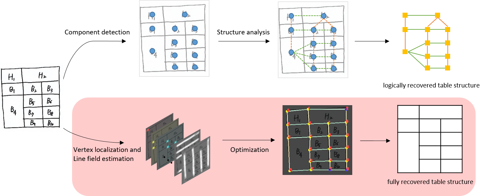

# Deep-learning and graph-based approach to table structure recognition

This is an official implementation of [Graph-based-TSR](https://link.springer.com/article/10.1007/s11042-021-11819-7) on Python 3, TensorFlow.



## Requirements
gurobipy

opencv-python

tqdm

sharedmem

## Data

Document data used in paper are stored in data folder.

See explanation in [data/config.txt](https://github.com/ejlee95/Graph-based-TSR/blob/main/data/config.txt).

## Execution

### Train

inside codes folder,

```
    python code_training/main.py --mode train --batch_size 6 --experiment_name model --data_dir ../data/ctdar19_B2_m/train/ --NUM_STACKS 2 --num_epochs EPOCHS --gpu GPU
```

See detailed arguments in [codes/code_training/set_default_training_options.py](https://github.com/ejlee95/Graph-based-TSR/blob/main/codes/code_training/set_default_training_options.py).

### Test

inside codes folder,

```
    python code_training/main.py --mode test --batch_size 1 --experiment_name bordered --test_data_dir ../data/ctdar19_B2_m/test/SCAN/img/ --test_name test --test_scan True
```

See detailed arguments in [codes/code_training/set_default_training_options.py](https://github.com/ejlee95/Graph-based-TSR/blob/main/codes/code_training/set_default_training_options.py).

## Table Structure Recognition results

### ICDAR 2019 competition dataset [Link](https://github.com/cndplab-founder/ICDAR2019_cTDaR)

| CascadeTabNet | TabStructNet | SPLERGE | Proposed | 
| ------------- | ------------ | ------- | -------- |
|  |  |  |  |

### Scanned ICDAR 2019 competition dataset

| CascadeTabNet | TabStructNet | SPLERGE | Proposed | 
| ------------- | ------------ | ------- | -------- |
|  |  |  |  |

### Scanned hospital receipts

| CascadeTabNet | TabStructNet | SPLERGE | Proposed | 
| ------------- | ------------ | ------- | -------- |
|  |  |  |  |

### Scanned hand-drawn documents

| CascadeTabNet | TabStructNet | SPLERGE | Proposed | 
| ------------- | ------------ | ------- | -------- |
|  |  |  |  |


##### Please use this to cite our work:

```
@article{lee2021deep,
  title={Deep-learning and graph-based approach to table structure recognition},
  author={Lee, Eunji and Park, Jaewoo and Koo, Hyung Il and Cho, Nam Ik},
  journal={Multimedia Tools and Applications},
  pages={1--22},
  year={2021},
  publisher={Springer}
}
```